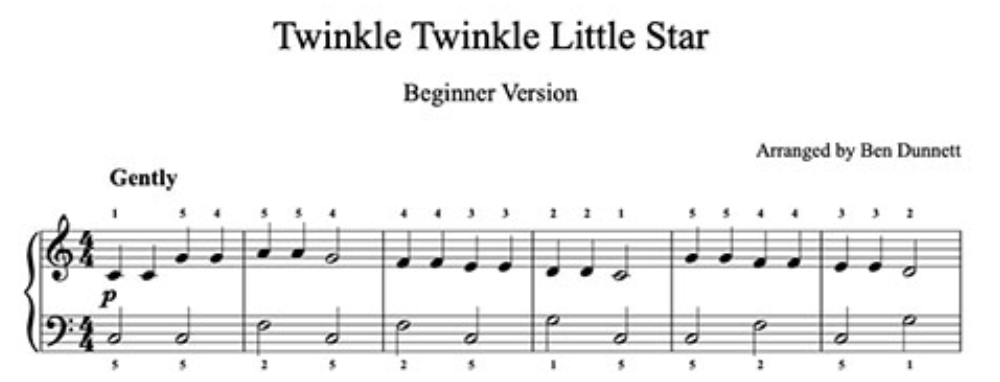
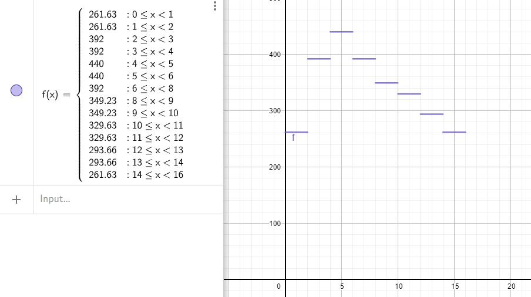

# HarmoNice
HarmoNice is a musical melodic predictor through polynomial interpolation with numerical methods.

## Técnicas a usar

Para implementar esto, decidimos hacer lo siguiente:

**1.** Graficamos una partitura como una función a trozos. El eje *x* representa los *beats* musicales para contar el tiempo y el eje *y* corresponde a la frecuencia en Hz de la nota.

|Antes|Después|
|--|--|
|||

**2.** Se transforma esta función en un **arreglo de tuplas** que pueda ser interpretado por Python

**3.** Sea $p$ un valor de precisión basado en la cantidad de puntos de referencia que se tomarán por nota. Este valor se inicializa en este paso. Si $p=1$, se tomará el punto más a la izquierda del intervalo para la tabla de valores.

**4.** Con los puntos seleccionados, se genera un polinomio interpolante que permitirá trazar una función nueva.

**5.** Se ejecuta el sonido que esta función de onda Hz en el tiempo produce y se comprueba con la parte armónica de la canción para ver su efectividad.